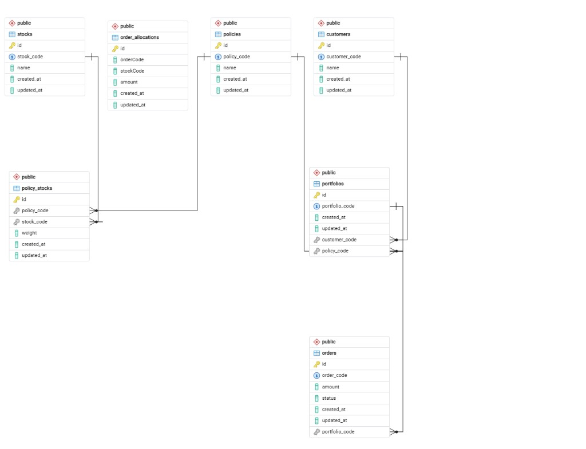

## Fund Management Subscription API

A backend service for managing customer portfolios and investment orders based on predefined investment policies.

The system allows customers to create portfolios, place orders, and automatically allocate investments into stocks according to policy weights.

Built using:

- **NestJS**
- **TypeORM**
- **PostgreSQL**
- **Docker**
- **Jest**

## 1. Database Schema

The database schema is designed to support:

- **Customers**
- **Portfolios**
- **Orders**
- **Investment policies**
- **Policy stock allocation**
- **Order allocation**

### Entities

- **customers**
- **stocks**
- **policies**
- **policy_stocks**
- **portfolios**
- **orders**
- **order_allocations**

### ERD Overview



### Tables

#### `customers`

- **id**
- **customer_code** (unique)
- **name**
- **created_at**
- **updated_at**

#### `stocks`

- **id**
- **stock_code** (unique)
- **name**
- **created_at**
- **updated_at**

#### `policies`

- **id**
- **policy_code** (unique)
- **name**
- **created_at**
- **updated_at**

#### `policy_stocks`

Defines stock allocation per policy.

- **id**
- **policy_code** (FK)
- **stock_code** (FK)
- **weight**
- **created_at**
- **updated_at**

Constraints:

- **UNIQUE(policy_code, stock_code)**

#### `portfolios`

- **id**
- **portfolio_code** (unique)
- **customer_code**
- **policy_code**
- **created_at**
- **updated_at**

#### `orders`

- **id**
- **order_code**
- **portfolio_code**
- **amount**
- **status**
- **created_at**
- **updated_at**

Order status:

- **PENDING**
- **PROCESSING**
- **COMPLETED**
- **FAILED**

#### `order_allocations`

- **id**
- **order_code**
- **stock_code**
- **amount**
- **created_at**
- **updated_at**

### Index Strategy

Indexes are used to optimize common queries.

- **Unique indexes**
  - `customers(customer_code)`
  - `stocks(stock_code)`
  - `policies(policy_code)`
  - `portfolios(portfolio_code)`

  Reason: these fields are frequently used for lookups in APIs.

- **Composite index**
  - `policy_stocks(policy_code, stock_code)`

  Reason: policy allocation queries require fast lookup of stocks belonging to a policy.

- **Portfolio active order check**
  - `orders(portfolio_code, status)`

  Reason: used to enforce the business rule: a portfolio cannot have more than one active order (**PENDING** or **PROCESSING**).

### Seed Data

Initial seed data includes:

- **Customers**
- **Stocks**
- **Policies**
- **PolicyStocks**

This data is used to simulate real investment scenarios.

## 2. REST API Design

The API follows RESTful resource-based design.

Resources are designed around core domain objects:

- **customers**
- **portfolios**
- **orders**

### Portfolio APIs

#### Create Portfolio

`POST /portfolios/create`

Example request:

```json
{
  "customerCode": "C001",
  "policyCode": "KMASTER"
}
```

### Order APIs

#### Create Order

`POST /orders/create`

Creates a new order for a portfolio.

Business rule enforced:

- If a portfolio already has an order with status **PENDING** or **PROCESSING**, a new order cannot be created.

Example request:

```json
{
  "portfolioCode": "P-1774523670535",
  "amount": 1000000
}
```

#### Get Orders

`GET /orders`

Returns all orders.

#### Cancel Order

`PATCH /orders/:orderCode/cancel`

Allowed only when **status = PENDING**.

#### Execute Order

`POST /orders/:orderCode/allocate`

This endpoint processes the order and performs stock allocation.

## 3. Unit Test

Unit tests are implemented using Jest.

Key test cases include:

- **Portfolio creation**
  - should create portfolio successfully

- **Order creation**
  - should create order if no active order exists
  - should prevent duplicate orders for the same portfolio (active = **PENDING** or **PROCESSING**)

### Duplicate order business rule scenario

- Given a portfolio with an active order
- When creating a new order
- Then the system rejects the request

## 4. Status Workflow Implementation

Order status follows the required workflow:

**PENDING → PROCESSING → COMPLETED**  
&nbsp;&nbsp;&nbsp;&nbsp;&nbsp;&nbsp;&nbsp;&nbsp;↘ **FAILED**

### Implementation Strategy

- When an order is created: **status = PENDING**
- When the system processes the order: **status → PROCESSING**
- After stock allocation succeeds: **status → COMPLETED**
- If an error occurs: **status → FAILED**

### Cancel Rule

Orders can only be cancelled when:

- **status = PENDING**

Reason: once processing starts, the order may already be interacting with trading systems.

## 5. Design Decisions

- **REST resource structure**: resources were designed around domain entities (`portfolios`, `orders`). This keeps the API intuitive and aligned with REST principles.
- **Separate `policy_stocks` table**: represents policy → stock allocation, enabling flexible portfolio strategies without duplicating stock data.
- **Order allocation table**: allocations are stored in `order_allocations` to track how each order distributes funds across multiple stocks.

## 6. Tradeoffs

### Simplicity vs Production Readiness

For the assignment, the implementation focuses on:

- **clarity**
- **business rule correctness**
- **maintainability**

Instead of production-level features such as:

- **message queues**
- **distributed transactions**
- **external trading systems**

### Order execution endpoint

The system exposes an execute endpoint for simplicity.

In a real-world system, order processing would likely be handled by:

- **background workers**
- **message queues**

## 7. What's Missing

Due to scope limitations, the following features were not implemented:

- **Authentication**: no authentication layer was added.
- **Pagination**: order listing does not include pagination.
- **Retry mechanisms**: order execution failure handling is simplified.
- **Background processing**: order execution is synchronous (in production, this would be handled using message queues / worker services).

## How to Run

- **Start database**

```bash
docker-compose up -d
```

- **Install dependencies**

```bash
npm install
```

- **Run the server**

```bash
npm run start:dev
```

- **Run tests**

```bash
npm run test
```
